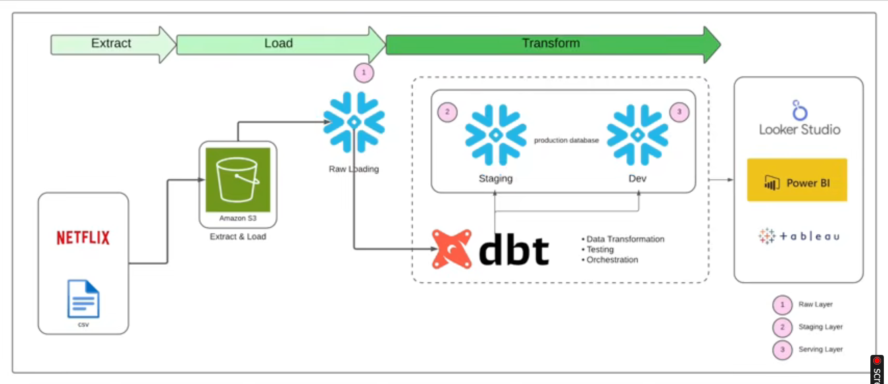

# Netflix ELT Pipeline with dbt, Snowflake, and AWS S3

## Project Overview

This project is an end-to-end ELT data engineering pipeline built using **AWS S3**, **Snowflake**, and **dbt**. The pipeline takes raw Netflix dataset files, loads them into a cloud data warehouse, transforms the data using dbt models, applies data quality checks, and prepares analytics-ready tables for business intelligence reporting.

The goal of this project is to demonstrate how a modern data stack works in a real data engineering workflow: raw data storage, cloud warehouse loading, SQL-based transformation, data testing, and reporting-ready output.

---

## Problem Statement

Media and streaming platforms generate large amounts of content data, including movies, TV shows, genres, release years, countries, cast members, directors, and ratings. Raw CSV files are not suitable for direct analysis because they often contain inconsistent formats, missing values, unclean columns, and duplicated information.

The problem is to convert raw Netflix data into clean, structured, and analytics-ready tables so business users can answer questions such as:

* How many movies and TV shows are available on the platform?
* Which countries produce the most Netflix content?
* What content categories are most common?
* How has Netflix content changed over the years?
* Which ratings and genres appear most frequently?

This project solves the problem by building an ELT pipeline that loads raw data into Snowflake and transforms it using dbt into clean staging and serving models.

---

## Solution

The solution follows a modern ELT architecture.

First, raw Netflix CSV data is stored in **Amazon S3** as the landing zone. Then, Snowflake loads the raw data from S3 into a raw database schema. After the data is loaded, **dbt** is used to clean, transform, test, and organize the data into separate layers.

The final transformed tables are designed for analytics and can be connected to BI tools such as Power BI, Tableau, or Looker Studio.

---

## Architecture

```text
Raw Netflix CSV
      |
      v
Amazon S3 Bucket
      |
      v
Snowflake Raw Layer
      |
      v
dbt Staging Models
      |
      v
dbt Serving / Mart Models
      |
      v
BI Tools / Dashboards
```

### Architecture Flow

1. **Raw Data Storage**

   * Netflix CSV data is uploaded to Amazon S3.
   * S3 acts as a scalable cloud storage layer.

2. **Data Loading into Snowflake**

   * Snowflake is used as the cloud data warehouse.
   * Raw files are loaded into Snowflake tables.
   * The raw layer keeps the original structure of the dataset.

3. **Data Transformation with dbt**

   * dbt models are used to clean and transform the data.
   * Staging models standardize column names, data types, and basic cleaning.
   * Serving models apply business logic and create analytics-ready tables.

4. **Data Quality Testing**

   * dbt tests are used to check data quality.
   * Tests help verify unique values, not-null fields, and valid relationships.

5. **BI Consumption**

   * Final tables can be connected with Power BI, Tableau, or Looker Studio.
   * Business users can analyze Netflix content trends from clean data.

---

## Tech Stack

| Category        | Tools                            |
| --------------- | -------------------------------- |
| Cloud Storage   | Amazon S3                        |
| Data Warehouse  | Snowflake                        |
| Transformation  | dbt                              |
| Language        | SQL                              |
| Data Format     | CSV                              |
| BI Tools        | Power BI, Tableau, Looker Studio |
| Version Control | GitHub                           |

---

## Dataset

The project uses a Netflix dataset containing information about movies and TV shows.

Common columns include:

* `show_id`
* `type`
* `title`
* `director`
* `cast`
* `country`
* `date_added`
* `release_year`
* `rating`
* `duration`
* `listed_in`
* `description`

---

## dbt Model Layers

### 1. Raw Layer

The raw layer contains the original data loaded from the CSV file into Snowflake. No major transformation is applied at this stage.

Purpose:

* Preserve original data
* Keep a backup of the source structure
* Use as the base for dbt transformations

---

### 2. Staging Layer

The staging layer cleans and standardizes the raw data.

Example transformations:

* Renaming columns into a consistent format
* Casting dates into proper date format
* Handling missing values
* Removing unnecessary spaces
* Standardizing text fields
* Preparing clean base tables for further transformation

Example model name:

```text
stg_netflix_titles
```

---

### 3. Serving / Mart Layer

The serving layer contains business-ready tables for analytics and reporting.

Possible models:

```text
mart_content_summary
mart_country_content
mart_genre_analysis
mart_yearly_content_trend
mart_rating_distribution
```

These models help answer business questions related to Netflix content trends, categories, countries, and release years.

---

## Business Questions Answered

This project can help answer:

1. How many movies and TV shows are available in the dataset?
2. Which content type is more common: Movies or TV Shows?
3. Which countries have the highest number of Netflix titles?
4. Which genres/categories appear the most?
5. How has content release changed over the years?
6. What are the most common maturity ratings?
7. Which years had the highest number of released titles?

---

## Key Features

* End-to-end ELT pipeline
* Cloud-based raw data storage using AWS S3
* Snowflake data warehouse integration
* Modular SQL transformations using dbt
* Separate raw, staging, and serving layers
* dbt testing for data quality
* Analytics-ready tables for BI dashboards
* Clean project structure for maintainability

---

## Data Quality Checks

dbt tests can be used to validate the transformed data.

Examples:

* `not_null` test on important columns such as `show_id` and `title`
* `unique` test on `show_id`
* Accepted value checks for content type, such as `Movie` and `TV Show`
* Relationship checks between staging and mart models

These tests help make sure the final reporting tables are reliable and consistent.

---

## Project Structure

```text
.
├── models/
│   ├── staging/
│   │   └── stg_netflix_titles.sql
│   ├── marts/
│   │   ├── mart_content_summary.sql
│   │   ├── mart_country_content.sql
│   │   ├── mart_genre_analysis.sql
│   │   └── mart_yearly_content_trend.sql
│
├── macros/
├── seeds/
├── snapshots/
├── tests/
├── imgs/
├── logs/
├── dbt_project.yml
└── README.md
```

---

## How to Run This Project

### 1. Clone the Repository

```bash
git clone https://github.com/itsSaifullahkhan/netflix-elt-pipeline-dbt-snowflake.git
cd netflix-elt-pipeline-dbt-snowflake
```

### 2. Install dbt for Snowflake

```bash
pip install dbt-snowflake
```

### 3. Configure Snowflake Profile

Create or update your `profiles.yml` file with your Snowflake account details.

Example:

```yaml
netflix_dbt:
  target: dev
  outputs:
    dev:
      type: snowflake
      account: your_account
      user: your_username
      password: your_password
      role: your_role
      database: your_database
      warehouse: your_warehouse
      schema: your_schema
      threads: 4
```

Do not upload real passwords, account secrets, or credentials to GitHub.

### 4. Test Connection

```bash
dbt debug
```

### 5. Run dbt Models

```bash
dbt run
```

### 6. Run dbt Tests

```bash
dbt test
```

### 7. Generate dbt Documentation

```bash
dbt docs generate
dbt docs serve
```

---

## Expected Output

After running the pipeline, Snowflake contains clean and analytics-ready tables such as:

* Content summary table
* Country-wise content table
* Genre analysis table
* Yearly content trend table
* Rating distribution table

These tables can be connected to BI tools for dashboarding and reporting.

---

## Screenshots

### Architecture Diagram



## Challenges Faced

Some challenges in this project included:

* Designing a clean ELT architecture
* Organizing dbt models into proper layers
* Handling missing and inconsistent values in the dataset
* Maintaining clean SQL model structure
* Preparing reporting-ready tables for BI use
* Understanding how raw, staging, and mart layers work together

---

## What I Learned

Through this project, I learned:

* How to design an ELT pipeline using a modern data stack
* How to use AWS S3 as a raw data landing zone
* How to load data into Snowflake
* How to build modular SQL transformations using dbt
* How to separate raw, staging, and serving layers
* How to apply dbt tests for data quality
* How to prepare clean tables for BI reporting

---

## Future Improvements

In the future, this project can be improved by:

* Adding Airflow for workflow orchestration
* Automating S3 to Snowflake loading
* Adding Snowpipe for continuous ingestion
* Creating a Power BI dashboard
* Adding more advanced dbt tests
* Adding CI/CD for dbt validation
* Deploying dbt documentation online

---

## Final Result

This project successfully demonstrates a complete ELT workflow using AWS S3, Snowflake, and dbt. It converts raw Netflix CSV data into clean, structured, tested, and analytics-ready tables that can support reporting and dashboarding.

---

## Author

**Saifullah Khan**
Cloud Data Engineer | BS Financial Technology Student
GitHub: [itsSaifullahkhan](https://github.com/itsSaifullahkhan)
LinkedIn:(https://www.linkedin.com/in/saifullah-khan-b4616225b/)
